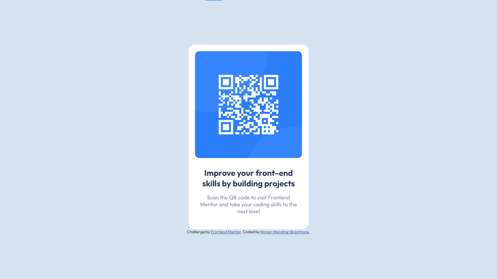

# Frontend Mentor - QR code component solution

This is a solution to the [QR code component challenge on Frontend Mentor](https://www.frontendmentor.io/challenges/qr-code-component-iux_sIO_H). Frontend Mentor challenges help you improve your coding skills by building realistic projects. 

## Table of contents

  - [Screenshot](#screenshot)
  - [Links](#links)
- [Author](#author)
- [Acknowledgments](#acknowledgments)

### Screenshot

### Links

- Solution URL: (https://nayanbramhane.github.io/QR-Code-FrontendMentor/)
- Live Site URL: (https://your-live-site-url.com)

## Author

- Website - [Nayan Bramhane](https://nayan-b-portfolio.netlify.app)
- Frontend Mentor - [@NayanBramhane](https://www.frontendmentor.io/profile/NayanBramhane)
- Twitter - [@BramhaneNayan](https://twitter.com/BramhaneNayan)

## Acknowledgments

Thank you Mr Coder, link to his channel : (https://www.youtube.com/@MrCoderYt).
